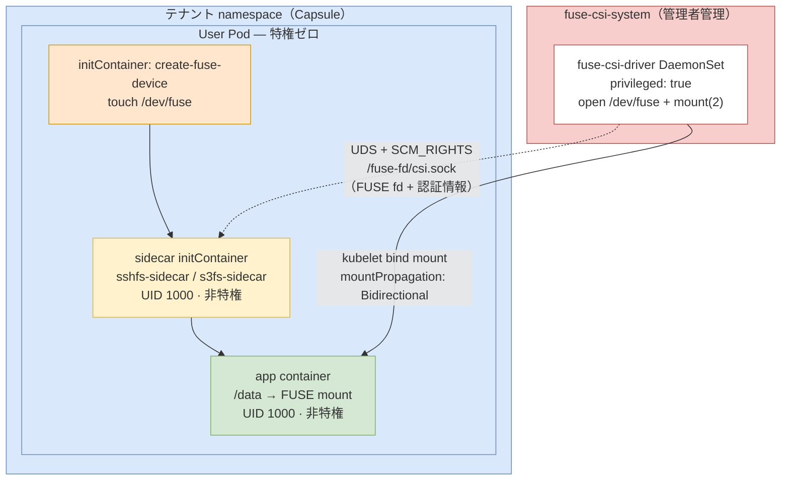

# FUSE CSI Driver for Kubernetes (PSS Restricted)

このリポジトリは、Kubernetes で FUSE（sshfs/s3fs）を使うための **CSI ドライバー実装**です。  
ポイントは、ユーザー Pod を非特権のまま維持しつつ、必要な特権処理だけを管理者側 DaemonSet に分離していることです。

## この実装で解決すること

- テナント Pod に `privileged: true` を与えずに FUSE マウントを提供
- PSS restricted 前提の運用と両立
- sshfs / s3fs のデータプレーンを sidecar で共通運用

## サポートするファイルシステム

| ファイルシステム | 用途 | 詳細 |
|---|---|---|
| `sshfs` | SSH/SFTP サーバー上のディレクトリをマウント | [`sshfs/README.md`](./sshfs/README.md) |
| `s3fs` | S3 互換ストレージ（AWS S3, MinIO など）をマウント | [`s3fs/README.md`](./s3fs/README.md) |

## アーキテクチャ（概要）



### 処理フロー

1. `fuse-csi-driver` がノード上で `/dev/fuse` を open し、`mount(2)` を実行  
2. FUSE fd と必要情報を UDS + `SCM_RIGHTS` で sidecar に受け渡し  
3. sidecar (`sshfs-sidecar` / `s3fs-sidecar`) が FUSE プロセスを起動  
4. アプリコンテナは `/data` を通常ボリュームとして利用

### 動作原理（詳細）

1. CSI DaemonSet（`fuse-csi-system`）が `NodePublishVolume` で `/dev/fuse` を open  
2. CSI 側でマウント準備を行い、UDS (`/fuse-fd/csi.sock`) を待受  
3. sidecar receiver が UDS 接続し、`SCM_RIGHTS` で FUSE fd を受信  
4. `fusermount3-stub` が libfuse 呼び出しを受け、受信済み fd を注入  
5. ユーザーアプリは `/data` へ通常 I/O（読み書き）を実行

## セキュリティモデル

- ユーザー Pod は `privileged: false` 前提
- securityContext は Kyverno で自動注入
  - `runAsNonRoot: true`
  - `runAsUser: 1000`
  - `allowPrivilegeEscalation: false`
  - `capabilities.drop: [ALL]`
  - `seccompProfile: RuntimeDefault`
- `hostUsers: false` は通常 Pod に適用
- FUSE CSI volume を持つ Pod は互換性のため `hostUsers: false` 注入を自動スキップ

### 権限の分離

| コンポーネント | namespace | 特権 | 管理主体 |
|---|---|---|---|
| `fuse-csi-driver` | `fuse-csi-system` | 必要（`privileged: true`） | クラスタ管理者 |
| `sshfs-sidecar` / `s3fs-sidecar` | テナント namespace | 不要 | テナント |
| アプリコンテナ | テナント namespace | 不要 | テナント |

## 前提

- Kubernetes クラスタ（Linux ノード）
- `kubectl` が利用可能
- Capsule / Kyverno ポリシーは適用済みであること
- CSI ノード用に `/dev/fuse` が利用可能

## クイックスタート（管理者）

### 1) CSI ドライバー導入

```bash
kubectl apply -f csi/fuse-csi-driver.yaml
kubectl apply -f csi/fuse-csi-driver-daemonset-prod.yaml
kubectl get pods -n fuse-csi-system
```

### 2) 動作確認

```bash
kubectl get ds -n fuse-csi-system fuse-csi-driver
kubectl logs -n fuse-csi-system -l app=fuse-csi-driver --tail=100
```

## セットアップ（テナントユーザー）

基本手順は「Secret 作成 → `deploy.yaml` の `volumeAttributes` 編集 → デプロイ」です。  
実装別の詳細は各 README を参照してください。

- sshfs: [`sshfs/README.md`](./sshfs/README.md)
- s3fs: [`s3fs/README.md`](./s3fs/README.md)

### Secret 作成例

```bash
# sshfs
kubectl create secret generic ssh-key \
  --from-file=private_key=~/.ssh/id_ed25519 \
  -n <tenant-namespace>

# s3fs
kubectl create secret generic s3-credentials \
  --from-literal=access_key=YOUR_ACCESS_KEY \
  --from-literal=secret_key=YOUR_SECRET_KEY \
  -n <tenant-namespace>
```

### デプロイ例

```bash
kubectl apply -f sshfs/deploy.yaml -n <tenant-namespace>
kubectl apply -f s3fs/deploy.yaml -n <tenant-namespace>
```

## プライベートリポジトリのイメージを使う場合

`ghcr.io` などのプライベートレジストリを使う場合は、namespace ごとに `imagePullSecret` を設定します。

### 1) 管理者側（CSI DaemonSet 用）

```bash
kubectl create secret docker-registry ghcr-secret \
  --docker-server=ghcr.io \
  --docker-username=<GITHUB_USERNAME> \
  --docker-password=<GITHUB_PAT_WITH_read:packages> \
  -n fuse-csi-system
```

その後、`csi/fuse-csi-driver-daemonset-prod.yaml` の `imagePullSecrets` に `ghcr-secret` を設定して再適用します。

### 2) テナント側（ユーザー Pod 用 sidecar）

```bash
kubectl create secret docker-registry ghcr-secret \
  --docker-server=ghcr.io \
  --docker-username=<GITHUB_USERNAME> \
  --docker-password=<GITHUB_PAT_WITH_read:packages> \
  -n <tenant-namespace>
```

`sshfs/deploy.yaml` または `s3fs/deploy.yaml` の Pod spec に `imagePullSecrets` を追加します。

```yaml
spec:
  imagePullSecrets:
    - name: ghcr-secret
```

## 各実装の比較

| 項目 | sshfs | s3fs |
|---|---|---|
| プロトコル | SSH/SFTP | S3 API |
| 主な接続先 | SSH サーバー | AWS S3 / MinIO / Ceph |
| Secret キー | `private_key` | `access_key`, `secret_key` |
| 主な `volumeAttributes` | `host`, `user`, `remotePath`, `port` | `bucket`, `endpoint`, `region` |
| 詳細手順 | [`sshfs/README.md`](./sshfs/README.md) | [`s3fs/README.md`](./s3fs/README.md) |

## よくある確認ポイント

- Pod が `ContainerCreating` で止まる
  - `kubectl describe pod <pod> -n <ns>`
  - `kubectl logs -n fuse-csi-system -l app=fuse-csi-driver`
- マウント後の確認
  - `kubectl exec <pod> -c app -n <ns> -- mount | grep fuse`
  - `kubectl exec <pod> -c app -n <ns> -- ls -la /data`
- sidecar ログ確認
  - `kubectl logs <pod> -c sshfs-sidecar -n <ns>`
  - `kubectl logs <pod> -c s3fs-sidecar -n <ns>`

## ディレクトリ構成

```text
tak_fuse_k8s/
├── README.md
├── csi/                    # CSI ドライバー配布マニフェスト
├── fuse-csi-driver/        # CSI ドライバー実装（Go）
├── sshfs-sidecar/          # sshfs 用 sidecar 実装（fd 受信）
├── s3fs-sidecar/           # s3fs 用 sidecar 実装（fd 受信）
├── sshfs/                  # sshfs 用ユーザー Pod マニフェスト + README
└── s3fs/                   # s3fs 用ユーザー Pod マニフェスト + README
```

## 運用メモ

- CI は `main` push でマルチアーキテクチャイメージを publish
