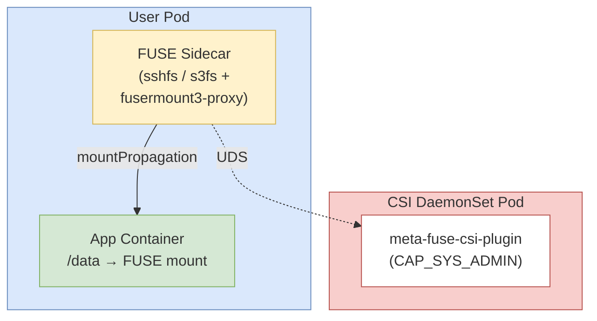

# Kubernetes FUSE マウント - meta-fuse-csi-plugin 実装例

[meta-fuse-csi-plugin](https://github.com/pfnet-research/meta-fuse-csi-plugin) を使用して、Kubernetes Pod 内で各種ファイルシステムをFUSEマウントするためのサイドカーコンテナ実装例です。

## 概要

このリポジトリは、Kubernetes上でFUSEベースのファイルシステムを安全にマウントするための実装を提供します。
fusermount3-proxyを使用することで、アプリケーションコンテナに`CAP_SYS_ADMIN`権限を付与せずにFUSEマウントを実現します。

## サポートするファイルシステム

| ファイルシステム | ディレクトリ | 説明 |
|----------------|------------|------|
| **sshfs** | [sshfs/](./sshfs/) | SSHプロトコルでリモートファイルシステムをマウント |
| **s3fs** | [s3fs/](./s3fs/) | S3互換ストレージ（MinIO、Ceph、AWS S3等）をマウント |

## アーキテクチャ



### 動作原理

1. **Sidecarコンテナ**がFUSEファイルシステム（sshfs、s3fs等）を起動
2. `touch /dev/fuse`により、libfuseがfusermount3経由パスを使用
3. **fusermount3-proxy**がfusermount3として動作し、UDSでCSI DaemonSetと通信
4. **CSI DaemonSet**が`CAP_SYS_ADMIN`権限でマウント操作を実行
5. **アプリケーションコンテナ**が権限なしでマウントされたファイルシステムにアクセス

## ディレクトリ構成

```
fuse_k8s/
├── README.md                      # このファイル
├── csi/                           # CSI ドライバー定義
│   ├── csi-driver.yaml            # CSIDriver リソース定義
│   └── csi-driver-daemonset.yaml  # CSI DaemonSet + RBAC
├── sshfs/                         # SSH リモートファイルシステム
│   ├── Dockerfile                 # sshfs サイドカーイメージ
│   ├── entrypoint.sh              # sshfs 起動スクリプト
│   ├── deploy-kind.yaml           # kind 向けデプロイマニフェスト
│   ├── deploy-registry.yaml       # レジストリ向けデプロイマニフェスト
│   └── README.md                  # sshfs 詳細ドキュメント
└── s3fs/                          # S3 互換ストレージ
    ├── Dockerfile                 # s3fs サイドカーイメージ
    ├── entrypoint.sh              # s3fs 起動スクリプト
    ├── deploy-kind.yaml           # kind 向けデプロイマニフェスト
    ├── deploy-registry.yaml       # レジストリ向けデプロイマニフェスト
    └── README.md                  # s3fs 詳細ドキュメント
```

## クイックスタート

### 1. 前提条件

- Kubernetes v1.29+ (SidecarContainers 機能が必要)
- kubectl がクラスターに接続済み

### 2. プライベートリポジトリの場合：イメージ認証設定

このリポジトリが **プライベート** に設定されている場合、GitHub Container Registry (`ghcr.io`) からイメージをpullするには GitHub Personal Access Token (PAT) が必要です。

#### PAT の発行

1. GitHub → **Settings** → **Developer settings** → **Personal access tokens** → **Tokens (classic)**
2. **Generate new token** をクリック
3. スコープで **`read:packages`** にチェックを入れてトークンを生成
4. 生成されたトークンをメモ（一度しか表示されません）

#### Docker CLI でのログイン（ローカルでイメージをpullする場合）

```bash
echo <YOUR_PAT> | docker login ghcr.io -u <GITHUB_USERNAME> --password-stdin
```

#### Kubernetes での imagePullSecret 作成（クラスターからpullする場合）

Pod が `ghcr.io` からイメージをpullできるよう、Secret を作成します：

```bash
kubectl create secret docker-registry ghcr-secret \
  --docker-server=ghcr.io \
  --docker-username=<GITHUB_USERNAME> \
  --docker-password=<YOUR_PAT>
```

作成した Secret は、`deploy-registry.yaml` の `imagePullSecrets` に追加してください：

```yaml
spec:
  imagePullSecrets:
    - name: ghcr-secret
```

> **注意**: リポジトリが **パブリック** の場合、この手順は不要です。

### 3. CSI ドライバーのデプロイ

すべてのFUSE実装で共通のCSIドライバーをデプロイします（1回のみ実施）。

```bash
kubectl apply -f csi/csi-driver.yaml
kubectl apply -f csi/csi-driver-daemonset.yaml

# DaemonSet の起動確認
kubectl get ds -n mfcp-system
kubectl get pods -n mfcp-system
```

### 4. 使用するファイルシステムを選択

各ファイルシステムの詳細なセットアップ手順は、それぞれのREADMEを参照してください：

#### SSH リモートファイルシステム (sshfs)
```bash
cd sshfs/
# 詳細は sshfs/README.md を参照
```
[→ sshfs/README.md](./sshfs/README.md)

#### S3 互換ストレージ (s3fs)
```bash
cd s3fs/
# 詳細は s3fs/README.md を参照
```
[→ s3fs/README.md](./s3fs/README.md)

## 各実装の比較

| 機能 | sshfs | s3fs |
|------|-------|------|
| **プロトコル** | SSH | HTTP/S (S3 API) |
| **認証方式** | SSH鍵ペア | アクセスキー/シークレットキー |
| **対応ストレージ** | SSHサーバー | AWS S3, MinIO, Ceph等 |
| **ユースケース** | 既存サーバーのファイル共有 | オブジェクトストレージのマウント |
| **Secret** | `ssh-key` (秘密鍵) | `s3-credentials` (アクセスキー) |

## 開発・テスト

### kind での開発

#### kind クラスターの作成

```bash
# kind のインストール (未インストールの場合)
# Linux
curl -Lo ./kind https://kind.sigs.k8s.io/dl/v0.20.0/kind-linux-amd64
chmod +x ./kind
sudo mv ./kind /usr/local/bin/kind

# macOS
brew install kind

# kind クラスターの作成
kind create cluster --name fuse-dev

# kubectl のコンテキスト確認
kubectl cluster-info --context kind-fuse-dev
```

#### イメージのビルドとロード

```bash
# ビルド
docker build -t sshfs-proxy:latest ./sshfs/
docker build -t s3fs-proxy:latest ./s3fs/

# kind にロード
kind load docker-image sshfs-proxy:latest --name fuse-dev
kind load docker-image s3fs-proxy:latest --name fuse-dev

# ロードされたイメージの確認
docker exec -it fuse-dev-control-plane crictl images | grep proxy
```

#### デプロイ

```bash
# kind 向けマニフェストを使用
kubectl apply -f sshfs/deploy-kind.yaml
kubectl apply -f s3fs/deploy-kind.yaml
```

#### kind クラスターの削除

開発が終了したらクラスターを削除できます。

```bash
# クラスターの削除
kind delete cluster --name fuse-dev

# すべてのkindクラスターを削除
kind delete clusters --all

# クラスター一覧の確認
kind get clusters
```

## トラブルシューティング

### CSI DaemonSet が起動しない

```bash
# DaemonSetの状態確認
kubectl get ds -n mfcp-system
kubectl describe ds -n mfcp-system meta-fuse-csi-plugin

# Podのログ確認
kubectl logs -n mfcp-system -l app.kubernetes.io/name=meta-fuse-csi-plugin
```

### マウントが失敗する

各実装のREADMEにあるトラブルシューティングセクションを参照してください：
- [sshfs トラブルシューティング](./sshfs/README.md#トラブルシューティング)
- [s3fs トラブルシューティング](./s3fs/README.md#トラブルシューティング)

### 一般的な確認項目

1. サイドカーコンテナのログ確認：
   ```bash
   kubectl logs <pod-name> -c sshfs-proxy  # または s3fs-proxy
   ```

2. マウント状態の確認：
   ```bash
   kubectl exec <pod-name> -c app -- mount | grep fuse
   ```

3. CSI DaemonSetとの通信確認：
   ```bash
   kubectl logs -n mfcp-system -l app.kubernetes.io/name=meta-fuse-csi-plugin
   ```

## セキュリティ考慮事項

- **サイドカーコンテナは `privileged: true` で動作**: fusermount3-proxyがUDS通信を行うために必要
- **`runAsNonRoot: false` の明示的設定**: CSI DaemonSet（csi-driver、node-driver-registrar）、サイドカーコンテナ、アプリコンテナに設定。Pod Security Admission が有効な環境でコンテナの起動を保証するため
- **アプリケーションコンテナは権限不要**: マウント済みファイルシステムへのアクセスのみ
- **Secret管理**: SSH鍵やS3認証情報はKubernetes Secretで管理
- **本番環境での推奨事項**:
  - SSH鍵にはパスフレーズを設定
  - S3ではSSL証明書検証を有効化
  - 最小権限の原則に従ってIAMロールやSSH権限を設定

## 参考資料

- [meta-fuse-csi-plugin](https://github.com/pfnet-research/meta-fuse-csi-plugin) - 本プロジェクトのベースとなるCSIプラグイン
- [sshfs](https://github.com/libfuse/sshfs) - SSH Filesystem
- [s3fs-fuse](https://github.com/s3fs-fuse/s3fs-fuse) - S3 Filesystem FUSE
- [Kubernetes SidecarContainers](https://kubernetes.io/docs/concepts/workloads/pods/sidecar-containers/) - Kubernetes v1.29+ のサイドカー機能

## ライセンス

各ツールのライセンスに従います：
- meta-fuse-csi-plugin: Apache License 2.0
- sshfs: GPL
- s3fs-fuse: GPL-2.0

## コントリビューション

新しいFUSEファイルシステムの実装を追加する場合：
1. 新しいディレクトリを作成（例: `nfs/`, `gcsfuse/`）
2. 同じパターンでDockerfile、entrypoint.sh、deploy.yamlを作成
3. README.mdで詳細を文書化
4. このREADMEの対応表に追加
