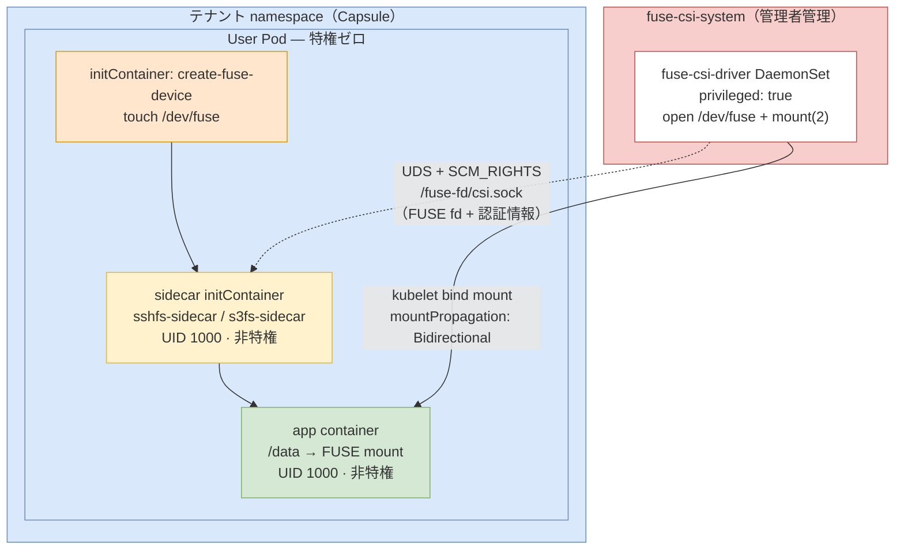

# Kubernetes FUSE マウント（PSS Restricted 対応）

Kubernetes Pod 内で sshfs・s3fs をマウントするための **CSI ドライバー実装**です。
独自の **fd-passing アーキテクチャ** により、ユーザー Pod が一切の特権を必要とせず、[Pod Security Standards (PSS) restricted](https://kubernetes.io/docs/concepts/security/pod-security-standards/) に完全準拠したまま FUSE マウントを実現します。

## 対象環境

| 環境 | 構成 |
|------|------|
| **開発** | kind（devcontainer） |
| **本番** | Rancher で構築した RKE2、Capsule + Kyverno マルチテナント |

## サポートするファイルシステム

| ファイルシステム | 説明 |
|----------------|------|
| **sshfs** | SSH プロトコルでリモートファイルシステムをマウント |
| **s3fs** | S3 互換ストレージ（MinIO、Ceph、AWS S3 等）をマウント |

## アーキテクチャ



### 動作原理

1. **CSI DaemonSet**（`fuse-csi-system`、特権コンテナ）が `/dev/fuse` を開き `mount(2)` でカーネルマウントを実行
2. FUSE fd と認証情報を **Unix Domain Socket + SCM_RIGHTS** でサイドカーへ送信（認証情報はディスク非保存）
3. **サイドカー**（UID 1000、特権不要）が fd を受け取り `sshfs`/`s3fs` デーモンを起動
4. **fusermount3-stub** が libfuse のマウント呼び出しを横取りし、渡された fd を注入
5. **アプリコンテナ**が特権なしでマウント済みファイルシステムへアクセス

### 権限の分離

| コンポーネント | namespace | 特権 | 管理者 |
|--------------|-----------|------|--------|
| CSI DaemonSet | `fuse-csi-system` | `privileged: true` | クラスター管理者のみ |
| sshfs/s3fs サイドカー | テナント namespace | 不要 | テナントユーザー |
| アプリコンテナ | テナント namespace | 不要 | テナントユーザー |

## Capsule + Kyverno によるセキュリティ自動適用

本番環境では Capsule テナントに属する全 Pod に対し、Kyverno が以下を **自動注入** します。ユーザーは securityContext を書く必要がありません。

| 設定 | 値 | 効果 |
|------|----|------|
| `runAsNonRoot` | `true` | root での実行を禁止 |
| `runAsUser` | `1000` | UID 1000 で実行 |
| `seccompProfile` | `RuntimeDefault` | seccomp プロファイル適用 |
| `allowPrivilegeEscalation` | `false` | 特権昇格を禁止 |
| `capabilities.drop` | `ALL` | 全 capability を削除 |
| `hostUsers` | `false` | ホスト UID 空間から分離（コンテナ脱出リスク低減） |

> **FUSE ボリュームの例外**：`/dev/fuse` は `MOUNT_ATTR_IDMAP`（idmapped mount）非対応のため、FUSE CSI ボリュームを持つ Pod には `hostUsers: false` が注入されません（Kyverno ポリシーで自動除外）。ただし他の PSS restricted 設定はすべて適用されます。

Kyverno ポリシーの詳細は [`policy/`](./policy/) を参照してください。

## ディレクトリ構成

```
tak_fuse_k8s/
├── fuse-csi-driver/          # CSI ドライバー本体（Go）
│   ├── cmd/                  # エントリポイント
│   └── pkg/driver/           # NodePublishVolume / fd-passing 実装
├── sshfs-sidecar/            # sshfs サイドカーイメージ（Go）
│   ├── receiver/             # UDS クライアント・sshfs 起動
│   └── fusermount3-stub/     # libfuse マウント呼び出し横取り
├── s3fs-sidecar/             # s3fs サイドカーイメージ（Go）
│   ├── receiver/             # UDS クライアント・s3fs 起動
│   └── fusermount3-stub/     # libfuse マウント呼び出し横取り
├── csi/                      # CSI ドライバー用 Kubernetes マニフェスト
│   ├── fuse-csi-driver.yaml                # Namespace + CSIDriver
│   ├── fuse-csi-driver-daemonset.yaml      # kind / devcontainer 用
│   ├── fuse-csi-driver-daemonset-prod.yaml # RKE2 / kubeadm 用
│   └── fuse-csi-driver-daemonset-k3s.yaml  # k3s 用
├── sshfs/                    # sshfs ユーザー Pod サンプル
├── s3fs/                     # s3fs ユーザー Pod サンプル
├── policy/                   # Capsule テナント・Kyverno ポリシー定義
├── docs/                     # 設計・運用ガイド
└── old/                      # 旧アーキテクチャ（参照用・非推奨）
```

---

## セットアップ（管理者）

CSI ドライバーのデプロイはクラスター管理者が行います。テナントユーザーはこの手順は不要です。

### 1. CSI ドライバーのデプロイ

```bash
kubectl apply -f csi/fuse-csi-driver.yaml
```

クラスター種別に応じて DaemonSet マニフェストを選択してください：

```bash
# kind / devcontainer
kubectl apply -f csi/fuse-csi-driver-daemonset.yaml

# RKE2（Rancher 構築）/ kubeadm
kubectl apply -f csi/fuse-csi-driver-daemonset-prod.yaml

# k3s
kubectl apply -f csi/fuse-csi-driver-daemonset-k3s.yaml
```

```bash
# 起動確認
kubectl get pods -n fuse-csi-system
```

### 2. Capsule + Kyverno ポリシーの適用

```bash
# Capsule テナント定義（tenant name / owner は実環境に合わせて変更）
kubectl apply -f policy/capsule-tenant-example.yaml

# Kyverno: PSS restricted securityContext 自動注入
kubectl apply -f policy/kyverno-force-securecontext.yaml

# Kyverno: hostUsers: false 自動設定（FUSE ボリューム Pod は自動除外）
kubectl apply -f policy/kyverno-force-userns.yaml
```

---

## セットアップ（テナントユーザー）

### Secret の作成

```bash
# sshfs: SSH 秘密鍵
# ⚠️ --from-file を使うこと。--from-literal は末尾改行を除去するため libcrypto エラーが発生する
kubectl create secret generic ssh-key \
  --from-file=private_key=~/.ssh/id_ed25519 \
  -n <your-namespace>

# s3fs: S3 認証情報
kubectl create secret generic s3-credentials \
  --from-literal=access_key=YOUR_ACCESS_KEY \
  --from-literal=secret_key=YOUR_SECRET_KEY \
  -n <your-namespace>
```

### Pod のデプロイ

```bash
# sshfs
kubectl apply -f sshfs/deploy-kind-fdpass.yaml -n <your-namespace>

# s3fs
kubectl apply -f s3fs/deploy-kind-fdpass.yaml -n <your-namespace>
```

マニフェスト内の `volumeAttributes`（`host`、`user`、`remotePath`、`bucket` 等）を環境に合わせて変更してください。

**securityContext は Kyverno が自動注入するため、Pod マニフェストへの記述は不要です。**

---

## 各実装の比較

| 機能 | sshfs | s3fs |
|------|-------|------|
| **プロトコル** | SSH | HTTP/S (S3 API) |
| **認証方式** | SSH 鍵ペア | アクセスキー / シークレットキー |
| **対応ストレージ** | SSH サーバー | AWS S3, MinIO, Ceph 等 |
| **Secret キー** | `private_key` | `access_key`, `secret_key` |
| **主な volumeAttributes** | `host`, `user`, `remotePath`, `port` | `bucket`, `endpoint`, `region` |

---

## 開発（kind 環境）

```bash
# クラスター作成
kind create cluster --name fuse-dev --config .devcontainer/kind-config.yaml

# イメージのビルドと kind へのロード
cd fuse-csi-driver && docker build -t fuse-csi-driver:latest . && cd ..
docker build -t sshfs-sidecar:latest ./sshfs-sidecar/
docker build -t s3fs-sidecar:latest ./s3fs-sidecar/
kind load docker-image fuse-csi-driver:latest sshfs-sidecar:latest s3fs-sidecar:latest --name fuse-dev

# ユニットテスト
cd fuse-csi-driver && go test ./pkg/driver/...
go test ./pkg/driver/ -run TestMountSshfs_MissingHost  # 単一テスト

# 統合テスト（fd-passing 動作確認）
.devcontainer/test-fdpass.sh

# クラスター削除
kind delete cluster --name fuse-dev
```

---

## トラブルシューティング

### CSI DaemonSet が起動しない

```bash
kubectl get pods -n fuse-csi-system
kubectl describe ds -n fuse-csi-system fuse-csi-driver
kubectl logs -n fuse-csi-system -l app=fuse-csi-driver
```

### マウントが失敗する

```bash
# サイドカーのログ確認
kubectl logs <pod-name> -c sshfs-sidecar   # または s3fs-sidecar

# マウント状態の確認
kubectl exec <pod-name> -c app -- mount | grep fuse

# CSI ドライバーのログ確認
kubectl logs -n fuse-csi-system -l app=fuse-csi-driver
```

### SSH 鍵エラー（`error in libcrypto`）

```bash
kubectl delete secret ssh-key -n <your-namespace>
kubectl create secret generic ssh-key \
  --from-file=private_key=~/.ssh/id_ed25519 \
  -n <your-namespace>
```

### Kyverno 注入の確認

```bash
kubectl get pod <pod-name> -n <tenant-ns> -o yaml | \
  grep -A5 "runAsNonRoot\|seccompProfile\|allowPrivilegeEscalation\|hostUsers"
```

---

## プライベートレジストリからのイメージ取得

`ghcr.io` からイメージを pull する場合、GitHub PAT（スコープ: `read:packages`）が必要です。

```bash
# Kubernetes imagePullSecret の作成
kubectl create secret docker-registry ghcr-secret \
  --docker-server=ghcr.io \
  --docker-username=<GITHUB_USERNAME> \
  --docker-password=<YOUR_PAT> \
  -n fuse-csi-system

# DaemonSet の imagePullSecrets を有効化（prod マニフェスト内のコメントを外す）
```

リポジトリがパブリックの場合は不要です。

## CI/CD

push to `main` でマルチプラットフォームイメージ（linux/amd64 + linux/arm64）をビルドし公開：

- `ghcr.io/scaleworx-inc/fuse_k8s-sshfs:latest`
- `ghcr.io/scaleworx-inc/fuse_k8s-s3fs:latest`

タグ形式：`latest`（main ブランチ）、`YYYYMMDD-{sha}`

## 参考資料

- [sshfs](https://github.com/libfuse/sshfs) - SSH Filesystem
- [s3fs-fuse](https://github.com/s3fs-fuse/s3fs-fuse) - S3 Filesystem FUSE
- [Kubernetes Pod Security Standards](https://kubernetes.io/docs/concepts/security/pod-security-standards/)
- [Kubernetes SidecarContainers](https://kubernetes.io/docs/concepts/workloads/pods/sidecar-containers/) - v1.29+
- [Capsule](https://capsule.clastix.io/) - Kubernetes マルチテナント
- [Kyverno](https://kyverno.io/) - Kubernetes ポリシーエンジン
- [SCM_RIGHTS (unix(7))](https://man7.org/linux/man-pages/man7/unix.7.html) - ファイルディスクリプタの UDS 受け渡し
- 設計詳細: [`docs/design-fuse-csi-driver-pss-restricted.md`](./docs/design-fuse-csi-driver-pss-restricted.md)

## ライセンス

各ツールのライセンスに従います：
- sshfs: GPL
- s3fs-fuse: GPL-2.0

## コントリビューション

新しい FUSE ファイルシステムを追加する場合：
1. `sshfs-sidecar/` をテンプレートとして新しいサイドカーディレクトリを作成
2. `fusermount3-stub/main.go` はそのままコピー（全実装で共通）
3. `fuse-csi-driver/pkg/driver/node.go` に `case` を追加
4. GitHub Actions のマトリックス（`.github/workflows/docker-image.yml`）に追加
