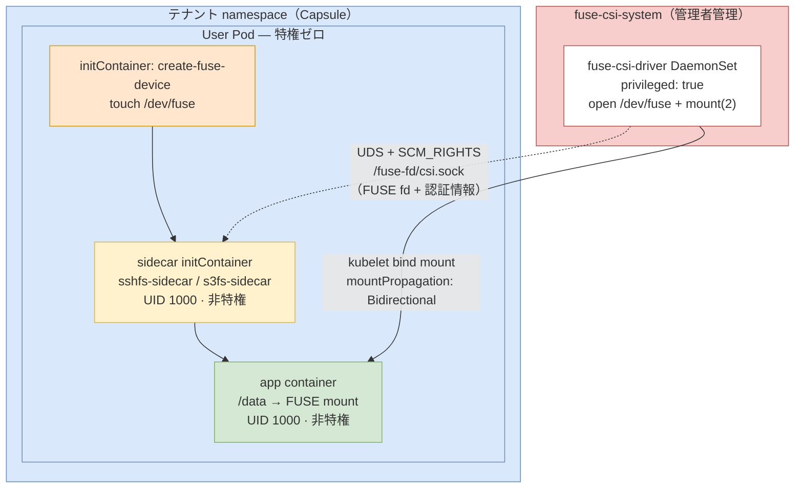

# FUSE CSI Driver for Kubernetes (PSS Restricted)

このリポジトリは、**CSI ドライバー中心**で FUSE マウント（sshfs/s3fs）を提供します。  
ユーザー Pod は非特権のまま、特権が必要な処理（`/dev/fuse` open / `mount(2)`）のみを `fuse-csi-driver` DaemonSet に集約します。

## アーキテクチャ（概要）



1. `fuse-csi-driver`（管理者管理、`fuse-csi-system`）が `/dev/fuse` を開きマウントを準備。
2. FUSE fd を UDS + `SCM_RIGHTS` でユーザー Pod の sidecar に受け渡し。
3. sidecar (`sshfs-sidecar` / `s3fs-sidecar`) が fd を使って FUSE プロセスを起動。
4. アプリコンテナは `/data` を通常ボリュームとして利用。

## セキュリティモデル

- ユーザー Pod は `privileged: false` 前提
- securityContext は Kyverno で自動注入（`runAsNonRoot`, `seccomp`, `capabilities.drop` など）
- `hostUsers: false` は通常 Pod に適用、FUSE CSI volume を持つ Pod は非互換回避で自動除外

関連ポリシー: `policy/`

## クイックスタート（管理者）

```bash
kubectl apply -f csi/fuse-csi-driver.yaml
kubectl apply -f csi/fuse-csi-driver-daemonset-prod.yaml
kubectl get pods -n fuse-csi-system
```

```bash
kubectl apply -f policy/capsule-tenant-example.yaml
kubectl apply -f policy/kyverno-force-securecontext.yaml
kubectl apply -f policy/kyverno-force-userns.yaml
```

## 実装別ドキュメント

- sshfs の使い方: [`sshfs/README.md`](./sshfs/README.md)
- s3fs の使い方: [`s3fs/README.md`](./s3fs/README.md)

## ディレクトリ

- `fuse-csi-driver/`: CSI ドライバー本体
- `sshfs-sidecar/`, `s3fs-sidecar/`: fd 受信 sidecar 実装
- `csi/`: CSI マニフェスト
- `policy/`: Capsule / Kyverno ポリシー
- `tests/`: テスト手順・検証マニフェスト

## 補足

- kind 検証手順は `tests/README.md` を参照
- CI は `main` push でマルチアーキテクチャイメージを publish
