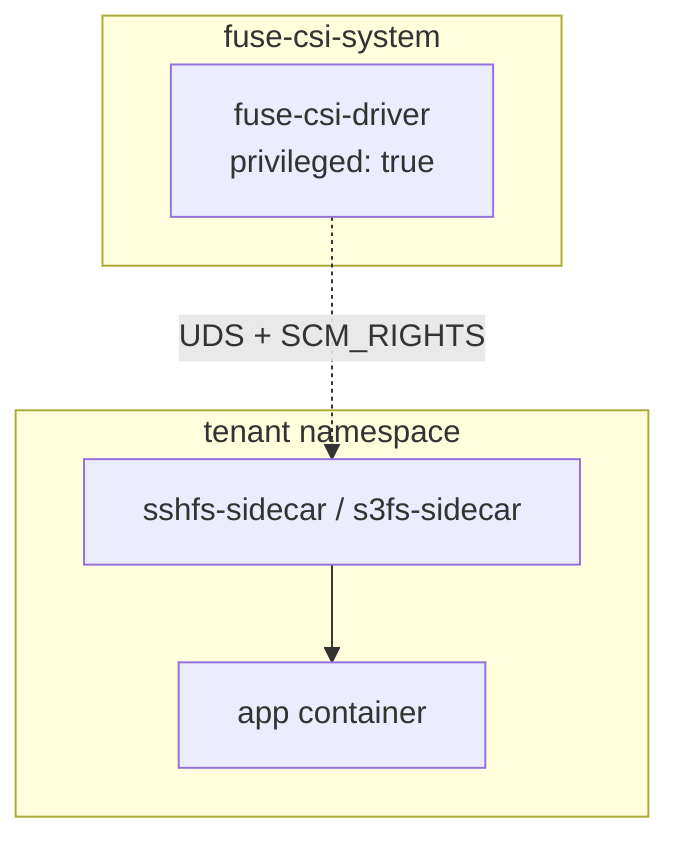

# 実装変更報告書

本文書は、現在の `fuse-csi-driver` 実装に合わせて、設計・実装上の主要な変更点を整理したものです。

## 要約

- 旧来の proxy ベース説明から、現行の fd-passing 構成へ更新
- 特権操作の集約先を CSI DaemonSet に限定
- ユーザー Pod 側は非特権・PSS restricted 前提を明確化
- 運用手順を `volumeAttributes` 直書き方式に統一

## 変更後アーキテクチャ

## 主な変更点

## Kubernetes バージョン前提

- Sidecar Containers 機能を前提に、Kubernetes v1.29+ を主対象とした構成へ整理

## マウント方式

- 旧記述の sidecar 前提説明を削除
- `fuse-csi-driver` + fd-passing（UDS + `SCM_RIGHTS`）に統一
- sidecar は receiver + `fusermount3-stub` による起動方式へ統一

## マニフェスト体系

- `csi/fuse-csi-driver.yaml`
- `csi/fuse-csi-driver-daemonset.yaml`
- `csi/fuse-csi-driver-daemonset-prod.yaml`

旧名称・旧パス参照は除去。

## セキュリティ方針

- ユーザー Pod は非特権前提
- 特権処理は CSI DaemonSet のみに集約
- policy（Capsule/Kyverno）適用時の挙動を現行前提で整理

### 補足

- `hostUsers: false` は通常 Pod へ適用
- FUSE CSI volume を持つ Pod は互換性上の理由で注入スキップ

## 認証情報の扱い

- sshfs: `ssh-key` Secret（`private_key`）
- s3fs: `s3-credentials` Secret（`access_key`, `secret_key`）
- 接続情報は `deploy.yaml` の `volumeAttributes` を直接編集して運用

ConfigMap テンプレート前提の手順は廃止。

## 実装別ディレクトリ運用

- `sshfs/` と `s3fs/` はそれぞれ個別 README を持ち、利用手順を分離
- ルート `README.md` は CSI 中心の説明に集約

## CI/CD とイメージ運用

- GitHub Actions によるマルチアーキテクチャイメージ公開を継続
- private registry 利用時は `imagePullSecrets` を namespace ごとに設定

## 変更影響

### 運用者への影響

- 旧 ConfigMap 前提の手順から `volumeAttributes` 直編集へ移行
- policy はクラスタ側で適用済み前提として利用者ドキュメントを簡素化

### ドキュメントへの影響

- `implementation-guide.md` / `README.md` / filesystem README と整合化
- 旧アーキテクチャ語彙を除去

## 関連ファイル

- `docs/implementation-guide.md`
- `README.md`
- `sshfs/README.md`
- `s3fs/README.md`
- `policy/*`
- `csi/*`
