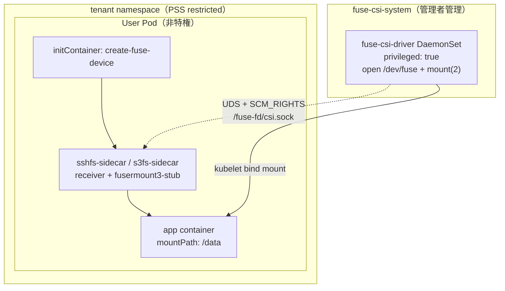

# 目的と概要

本ガイドは、現行の `fuse-csi-driver` 実装（fd-passing アーキテクチャ）を前提に、
設計意図・主要コンポーネント・導入/運用の実装観点をまとめた技術ドキュメントです。

## 目的

- ユーザー Pod を非特権（PSS restricted）で維持したまま FUSE マウントを提供する
- 特権が必要な処理（`/dev/fuse` open, `mount(2)`）のみを CSI DaemonSet に集約する
- sshfs / s3fs の 2 実装を共通アーキテクチャで扱う

## 全体アーキテクチャ



## コンポーネント責務

### CSI driver (`fuse-csi-driver/`)

- `NodePublishVolume`
  - `/dev/fuse` の open
  - カーネルマウント準備
  - UDS サーバー起動
  - sidecar へ fd を受け渡し
- `NodeUnpublishVolume`
  - fd クローズ
  - アンマウント
  - セッションの後始末

主要実装:

- `pkg/driver/node.go`
- `pkg/driver/fdpassing.go`
- `pkg/driver/sshfs.go`
- `pkg/driver/s3fs.go`

### sidecar (`sshfs-sidecar/`, `s3fs-sidecar/`)

- receiver が UDS 経由で fd を受信
- `fusermount3-stub` が libfuse 呼び出しに fd を注入
- `sshfs` / `s3fs` 本体をフォアグラウンド起動

## セキュリティモデル

| 項目 | ユーザー Pod | CSI DaemonSet |
|---|---|---|
| privileged | 不要 | 必要 |
| `CAP_SYS_ADMIN` | 不要 | 使用 |
| 主責務 | FUSE プロセス実行 | 特権操作集約 |

Kyverno で適用される代表設定:

- `runAsNonRoot: true`
- `runAsUser: 1000`
- `allowPrivilegeEscalation: false`
- `capabilities.drop: [ALL]`
- `seccompProfile: RuntimeDefault`

`hostUsers: false` は通常 Pod に適用されるが、FUSE CSI volume を持つ Pod は
互換性のためポリシー precondition で注入をスキップする。

## ディレクトリ構成

```text
tak_fuse_k8s/
├── csi/                      # CSI マニフェスト
├── fuse-csi-driver/          # CSI ドライバー実装（Go）
├── sshfs-sidecar/            # sshfs sidecar 実装（Go）
├── s3fs-sidecar/             # s3fs sidecar 実装（Go）
├── sshfs/                    # sshfs 利用マニフェスト
├── s3fs/                     # s3fs 利用マニフェスト
├── policy/                   # Capsule / Kyverno ポリシー
└── tests/                    # テスト関連
```

## インストール方法

### 導入フロー（管理者）

1. CSI リソース適用

```bash
kubectl apply -f csi/fuse-csi-driver.yaml
kubectl apply -f csi/fuse-csi-driver-daemonset-prod.yaml
```

2. 状態確認

```bash
kubectl get ds -n fuse-csi-system fuse-csi-driver
kubectl get pods -n fuse-csi-system
kubectl logs -n fuse-csi-system -l app=fuse-csi-driver --tail=100
```

3. policy 適用（環境側運用に応じて）

```bash
kubectl apply -f policy/capsule-tenant-example.yaml
kubectl apply -f policy/kyverno-force-securecontext.yaml
kubectl apply -f policy/kyverno-force-userns.yaml
```

## 利用方法

### テナント利用フロー（実装別）

`volumeAttributes` は `deploy.yaml` に直書きして利用する。

- sshfs 手順: `sshfs/README.md`
- s3fs 手順: `s3fs/README.md`

共通:

- Secret を先に作成（`ssh-key` / `s3-credentials`）
- Pod をデプロイ
- `/data` の読み書きで疎通確認

## プライベートレジストリ運用

`ghcr.io` などの private image を使う場合:

1. `fuse-csi-system` に `docker-registry` Secret 作成
2. CSI DaemonSet に `imagePullSecrets` 設定
3. 各 tenant namespace にも同様の Secret 作成
4. `sshfs/deploy.yaml` / `s3fs/deploy.yaml` の Pod spec に `imagePullSecrets` 追加

## トラブルシューティング（実装観点）

### Pod が `ContainerCreating` で止まる

- `kubectl describe pod <pod> -n <ns>`
- `kubectl logs -n fuse-csi-system -l app=fuse-csi-driver`
- Secret 名と `nodePublishSecretRef` の一致確認

### mount はあるがアクセス不可

- app コンテナの UID/GID とマウントオプションを確認
- sidecar ログ（`sshfs-sidecar` / `s3fs-sidecar`）を確認

### 画像 pull 失敗

- `ImagePullBackOff` の場合は `imagePullSecrets` と PAT scope (`read:packages`) を確認

## 実装を拡張する場合

新しい FUSE filesystem を追加する基本手順:

1. sidecar ディレクトリを追加（receiver + `fusermount3-stub`）
2. `fuse-csi-driver/pkg/driver/node.go` に `type` 分岐を追加
3. `MountXxx()` 実装を追加（検証 + fd passing 呼び出し）
4. マニフェストと CI の image build 対象を追加

---

このドキュメントは現行実装（`fuse-csi-driver` 系）に合わせて維持する。  
README 群（`README.md`, `sshfs/README.md`, `s3fs/README.md`）と整合しない変更は避けること。
