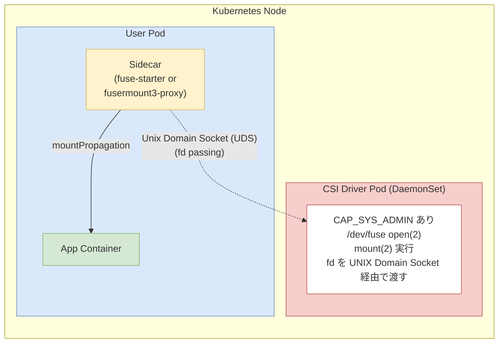
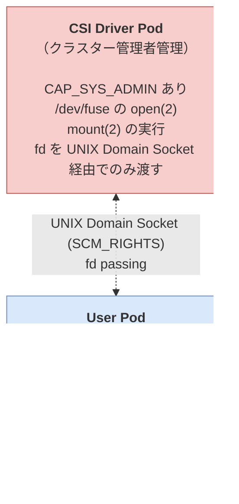

# 目的と概要
本ドキュメントは、FUSE 向け汎用CSIドライバであるmeta-fuse-csi-pluginについて、本番環境で利用可能にするための実装方法をまとめたドキュメントです。

# meta-fuse-csi-pluginとは
FUSE（Filesystem in UserSpace）を Kubernetes Pod 内で利用するには`/dev/fuse`の`open(2)`と`mount(2)`が必要であり、`CAP_SYS_ADMIN`権限が求められます。一般ユーザーの Pod にこの権限を付与することはセキュリティ上推奨されません。

meta-fuse-csi-pluginは汎用 CSI プラグインとして、特権操作を CSI Driver Pod に集約し、User Pod は`CAP_SYS_ADMIN`なしで FUSE マウントを利用可能にします。


---

## セキュリティモデル



`SCM_RIGHTS`メッセージを利用した UNIX Domain Socket 経由の fd 受け渡しにより、特権操作はクラスター管理者管理の Pod に限定されます。

---

# meta-fuse-csi-plugin が提供する2つの方法

meta-fuse-csi-plugin では、以下の2つのマウント方法を提供しています。

| 項目 | fuse-starter | fusermount3-proxy |
|------|-------------|-------------------|
| **対象 FUSE ライブラリ** | libfuse3 / jacobsa/fuse | libfuse3 利用の任意実装 |
| **対応実装** | mountpoint-s3, gcsfuse | mountpoint-s3, goofys, s3fs, ros3fs, sshfs |
| **UNIX Domain Socket 通信** | CSI Driver → fuse-starter | FUSE 実装 → fusermount3-proxy → CSI Driver |
| **Rust `fuser` クレート対応** | ❌ | ✅ |

## 各種FUSE に対する meta-fuse-csi-plugin の動作状況

| FUSE 実装 | 対応アプローチ | ローカル kind 対応 |
|-----------|---------------|------------------|
| [mountpoint-s3](https://github.com/awslabs/mountpoint-s3) | fuse-starter / fusermount3-proxy | ✅ |
| [goofys](https://github.com/kahing/goofys) | fusermount3-proxy | ✅ |
| [s3fs](https://github.com/s3fs-fuse/s3fs-fuse) | fusermount3-proxy | ✅ |
| [ros3fs](https://github.com/MoSafi2/ros3fs) | fusermount3-proxy | ✅ |
| [gcsfuse](https://github.com/GoogleCloudPlatform/gcsfuse) | fuse-starter | ❌（GCS 必要） |
| [sshfs](https://github.com/libfuse/sshfs) | fusermount3-proxy | ✅ |

---

# 本実装での変更点

meta-fuse-csi-plugin の調査結果をもとに、以下の設計判断を行いました。

## Kubernetes バージョン要件の引き上げ
| | オリジナル | 本実装 |
|---|---|---|
| **要件** | K8s 1.20 以上推奨 | **K8s v1.29+ 必須** |

Kubernetes v1.29 で GA となった [SidecarContainers](https://kubernetes.io/docs/concepts/workloads/pods/sidecar-containers/) 機能（`initContainers` + `restartPolicy: Always`）を前提とした設計を採用しました。`startupProbe` でマウント完了を保証してから app コンテナを起動します。オリジナルで紹介されていた `while` ループによるポーリング方式は不要となりました。

## fusermount3-proxy のみ採用

| | オリジナル | 本実装 |
|---|---|---|
| **アプローチ** | fuse-starter / fusermount3-proxy の2種 | **fusermount3-proxy のみ** |

対象の sshfs・s3fs はいずれも libfuse3 ベースであり、fusermount3-proxy で統一的に対応可能です。

**実装方式:**

1. Dockerfile で fusermount3-proxy バイナリを `/bin/fusermount3` として直接配置します（バイナリ差し替え）
2. entrypoint.sh で `touch /dev/fuse` により通常ファイルを作成し、libfuse を fusermount3 経由パスにフォールバックさせます

## 対象 FUSE 実装の限定

| | オリジナル | 本実装 |
|---|---|---|
| **対象** | 6種 | **sshfs, s3fs の2種** |

## CSI ドライバーマニフェストの独自管理

| | オリジナル | 本実装 |
|---|---|---|
| **マニフェスト** | `./deploy/` をそのまま使用 | `csi/` に独自マニフェストを配置 |
| **RBAC** | 記載なし | ServiceAccount, ClusterRole, ClusterRoleBinding を追加 |
| **イメージバージョン** | `latest` | `v0.2.2` 固定 |

CSI ドライバーコンテナに加え `node-driver-registrar` (v2.10.0) を含む2コンテナ構成です。master/control-plane ノードへの tolerations を設定しています。

## セキュリティコンテキストの明示設定

全コンテナに `runAsNonRoot: false` を明示的に設定しています。

| 対象 | 設定 |
|------|------|
| CSI DaemonSet (csi-driver) | `privileged: true` + `runAsNonRoot: false` |
| CSI DaemonSet (node-driver-registrar) | `runAsNonRoot: false` |
| FUSE sidecar | `privileged: true` + `runAsNonRoot: false` |
| app コンテナ | `runAsNonRoot: false` |

Pod Security Admission が有効な環境で、コンテナイメージのデフォルト設定に依存せずコンテナの起動を保証するための措置です。

---

## Docker イメージのビルド・配布

| | オリジナル | 本実装 |
|---|---|---|
| **イメージ** | オリジナルの example イメージ | 独自 Dockerfile（マルチステージビルド） |
| **ビルド** | 手動 | GitHub Actions で自動ビルド・プッシュ |
| **タグ** | なし | `latest` + `YYYYMMDD-<commit sha>` |


## 認証情報の管理

| | オリジナル | 本実装 |
|---|---|---|
| **方式** | 環境変数にハードコード（テスト用） | **Kubernetes Secret** |

| FUSE 実装 | Secret 名 | キー | 展開方法 |
|---|---|---|---|
| sshfs | `ssh-key` | `private_key` | `secretKeyRef` → 環境変数 → entrypoint.sh でファイル出力 |
| s3fs | `s3-credentials` | `access_key`, `secret_key` | `secretKeyRef` → 環境変数 → entrypoint.sh で passwd-s3fs 生成 |


## CSI ボリューム属性の明示化

オリジナルでは `fdPassingEmptyDirName` のみですが、本実装では4つの属性を明示的に設定しています。

```yaml
volumeAttributes:
  socketDir: /var/lib/mfcp/uds
  socketName: mfcp.sock
  fdPassingEmptyDirName: fuse-socket-dir
  fdPassingSocketName: mfcp.sock
```

---

## リソース制限の追加

全コンテナに requests/limits を設定しています。

| コンテナ | CPU requests | CPU limits | Memory requests | Memory limits |
|---|---|---|---|---|
| FUSE sidecar | 50m | 200m | 64Mi | 256Mi |
| app | 10m | 100m | 32Mi | 128Mi |
| csi-driver | 50m | 200m | 64Mi | 256Mi |
| node-driver-registrar | 10m | 50m | 20Mi | 100Mi |

---

# 環境設定

## 前提条件

| 項目 | 要件 |
|------|------|
| Kubernetes | **v1.29+**（SidecarContainers 機能が必須） |
| OS | Linux ノード (`kubernetes.io/os=linux`) |
| ノード権限 | CSI Driver Pod 用の `CAP_SYS_ADMIN` をクラスター管理者が許可 |
| ローカル検証 | kind (Kubernetes in Docker) + Docker で動作確認可能 |

## サポートする FUSE 実装

| FUSE 実装 | 用途 |
|-----------|------|
| [sshfs](https://github.com/libfuse/sshfs) | SSH プロトコルでリモートファイルシステムをマウント |
| [s3fs](https://github.com/s3fs-fuse/s3fs-fuse) | S3 互換ストレージ（MinIO、Ceph、AWS S3 等）をマウント |

## ローカル検証環境の準備（kind）

```bash
kind create cluster --name fuse-dev
kubectl cluster-info --context kind-fuse-dev
```

---

# インストール方法

## CSI ドライバーのデプロイ

すべての FUSE 実装で共通です（クラスターにつき1回のみ）。

```bash
kubectl apply -f csi/fuse-csi-driver.yaml
kubectl apply -f csi/fuse-csi-driver-daemonset.yaml
```

## デプロイの確認

```bash
kubectl get ds -n mfcp-system
kubectl get pods -n mfcp-system
```

**正常な出力例：**

```
NAME                   DESIRED   CURRENT   READY   UP-TO-DATE   AVAILABLE   NODE SELECTOR            AGE
meta-fuse-csi-plugin   1         1         1       1            1           kubernetes.io/os=linux   1m
```

## サイドカーイメージの準備

**kind 環境の場合:**

```bash
docker build -t sshfs-proxy:latest ./sshfs/
docker build -t s3fs-proxy:latest ./s3fs/
kind load docker-image sshfs-proxy:latest --name fuse-dev
kind load docker-image s3fs-proxy:latest --name fuse-dev
```

**レジストリ利用の場合:**

GitHub Actions により main ブランチへの push 時に ghcr.io へ自動ビルド・プッシュされます。
各 `deploy.yaml` の `image` を自環境のレジストリに書き換えてください。

---

# 利用方法

## sshfs（SSH リモートファイルシステム）

### 認証情報の準備

```bash
# SSH 鍵ペアの生成（未作成の場合）
ssh-keygen -t ed25519 -f ~/.ssh/sshfs_key -N ""

# 公開鍵を SSH サーバーに配置
ssh-copy-id -i ~/.ssh/sshfs_key.pub user@your-ssh-server

# 秘密鍵を Kubernetes Secret として登録
kubectl create secret generic ssh-key \
  --from-file=private_key=${HOME}/.ssh/sshfs_key
```

### ConfigMap の作成

`sshfs/configmap.example.yaml` をコピーして環境別の ConfigMap を作成します。

```bash
cp sshfs/configmap.example.yaml sshfs/configmap.yaml
# 環境に合わせて値を編集
```

| ConfigMap キー | 説明 | 例 |
|---------|------|-----|
| `SSHFS_HOST` | SSH 接続先ホスト | `ssh.example.com` |
| `SSHFS_USER` | SSH ユーザー名 | `your-user` |
| `SSHFS_REMOTE_PATH` | リモートパス | `/home/your-user` |
| `SSHFS_PORT` | SSH ポート番号 | `22` |

---

### デプロイと動作確認

```bash
# ConfigMap を適用
kubectl apply -f sshfs/configmap.yaml

# デプロイ（kind 環境）
kubectl apply -f sshfs/deploy-kind.yaml

# デプロイ（レジストリ利用）
kubectl apply -f sshfs/deploy.yaml

# 動作確認
kubectl get pod sshfs-example
kubectl exec sshfs-example -c app -- mount | grep fuse.sshfs
kubectl exec sshfs-example -c app -- ls -la /data
```

## s3fs（S3 互換ストレージ）

### 認証情報の準備

```bash
kubectl create secret generic s3-credentials \
  --from-literal=access_key=YOUR_ACCESS_KEY \
  --from-literal=secret_key=YOUR_SECRET_KEY
```

### ConfigMap の作成

`s3fs/configmap.example.yaml` をコピーして環境別の ConfigMap を作成します。

```bash
cp s3fs/configmap.example.yaml s3fs/configmap.yaml
# 環境に合わせて値を編集
```

| ConfigMap キー | 説明 | 例 |
|---------|------|-----|
| `S3FS_BUCKET` | S3 バケット名 | `my-bucket` |
| `S3FS_ENDPOINT` | S3 エンドポイント URL | `http://minio.default:9000` |
| `S3FS_REGION` | リージョン | `us-east-1` |

### デプロイと動作確認

```bash
# ConfigMap を適用
kubectl apply -f s3fs/configmap.yaml

# デプロイ（kind 環境）
kubectl apply -f s3fs/deploy-kind.yaml

# デプロイ（レジストリ利用）
kubectl apply -f s3fs/deploy.yaml

# 動作確認
kubectl get pod s3fs-example
kubectl exec s3fs-example -c app -- mount | grep fuse.s3fs
kubectl exec s3fs-example -c app -- ls -la /data
```

---

# 付録: 環境変数リファレンス

## sshfs

| 変数名 | 必須 | デフォルト | 説明 |
|--------|------|-----------|------|
| `SSHFS_HOST` | ✓ | `localhost` | SSH 接続先ホスト |
| `SSHFS_USER` | ✓ | `root` | SSH ユーザー名 |
| `SSHFS_REMOTE_PATH` | | `/root/sshfs-example` | リモートマウントパス |
| `SSHFS_PORT` | | `22` | SSH ポート番号 |
| `SSHFS_MOUNT_POINT` | | `/tmp` | マウント先パス |
| `USE_LOCAL_SSHD` | | `false` | `true` でコンテナ内 sshd を起動 |
| `SSH_PRIVATE_KEY` | | - | SSH 秘密鍵（環境変数経由で注入する場合） |
| `FUSERMOUNT3PROXY_FDPASSING_SOCKPATH` | ✓ | `/var/lib/mfcp/uds/mfcp.sock` | UNIX Domain Socket |

## s3fs

| 変数名 | 必須 | デフォルト | 説明 |
|--------|------|-----------|------|
| `S3FS_BUCKET` | ✓ | - | S3 バケット名 |
| `S3FS_ENDPOINT` | ✓ | - | S3 エンドポイント URL |
| `S3FS_REGION` | | `us-east-1` | S3 リージョン |
| `S3FS_MOUNT_POINT` | | `/mnt/s3fs` | マウント先パス |
| `AWS_ACCESS_KEY_ID` | ✓ | - | アクセスキー（Secret から注入） |
| `AWS_SECRET_ACCESS_KEY` | ✓ | - | シークレットキー（Secret から注入） |
| `S3FS_OPTS` | | (空) | 追加の s3fs オプション |
| `FUSERMOUNT3PROXY_FDPASSING_SOCKPATH` | ✓ | `/var/lib/mfcp/uds/mfcp.sock` | UNIX Domain Socket |

---

# 参考資料

- [meta-fuse-csi-plugin](https://github.com/pfnet-research/meta-fuse-csi-plugin)
- [PFN 技術ブログ（英語）](https://tech.preferred.jp/en/blog/meta-fuse-csi-plugin/)
- [PFN 技術ブログ（日本語）](https://tech.preferred.jp/ja/blog/meta-fuse-csi-plugin/)
- [sshfs](https://github.com/libfuse/sshfs)
- [s3fs-fuse](https://github.com/s3fs-fuse/s3fs-fuse)
- [Kubernetes SidecarContainers](https://kubernetes.io/docs/concepts/workloads/pods/sidecar-containers/)
