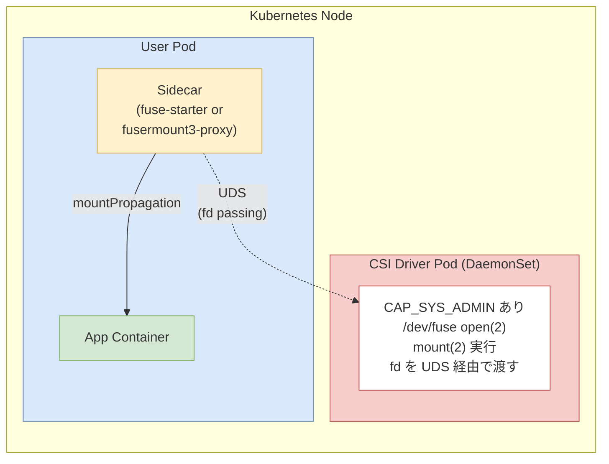
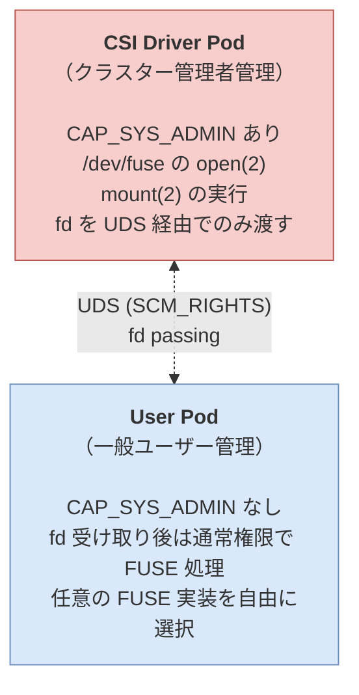

# meta-fuse-csi-plugin 外部ストレージマウント調査レポート

> **リポジトリ**: [pfnet-research/meta-fuse-csi-plugin](https://github.com/pfnet-research/meta-fuse-csi-plugin)  
> **ライセンス**: Apache 2.0  
> **開発元**: Preferred Networks, Inc. (PFN)

---

## 1. 概要

### meta-fuse-csi-plugin とは

`meta-fuse-csi-plugin` は、Kubernetes Pod において **CAP_SYS_ADMIN** 権限なしに、あらゆる FUSE 実装をマウント・実行できる汎用 CSI (Container Storage Interface) プラグインです。PFN（Preferred Networks）のインターンシップ成果として開発され、`gcs-fuse-csi-driver` をベースに汎用化されています。

### 背景と課題

FUSE（Filesystem in UserSpace）は Linux カーネルの機能で、ユーザー空間でファイルシステムを実装できます。Kubernetes Pod 内で FUSE を利用するには以下の操作が必要です。

- `/dev/fuse` を `open(2)` して fd（ファイルディスクリプタ）を取得
- `mount(2)` でマウントポイントを指定

これらの操作には `CAP_SYS_ADMIN` が必要ですが、一般ユーザーの Pod に `CAP_SYS_ADMIN` を付与することはセキュリティ上推奨されません。`meta-fuse-csi-plugin` はこの問題を解決します。

### アーキテクチャ



- **CSI Driver Pod**: クラスター管理者が DaemonSet として各ノードにデプロイ。特権操作（`/dev/fuse` の open・mount）を代行。`CAP_SYS_ADMIN` はこの Pod のみが保持
- **User Pod**: ユーザーが任意の FUSE 実装を `CAP_SYS_ADMIN` なしで使用。Sidecar コンテナが UDS 経由で CSI Driver Pod と通信

---

## 2. 環境設定

### 前提条件

| 項目 | 要件 |
|------|------|
| Kubernetes | バージョン 1.20 以上推奨 |
| OS | Linux ノード (`kubernetes.io/os=linux`) |
| ノード権限 | CSI Driver Pod 用の `CAP_SYS_ADMIN` をクラスター管理者が許可 |
| ローカル検証 | kind (Kubernetes in Docker) で動作確認可能 |

### ローカル検証環境の準備（kind）

```bash
# kind クラスターの作成
kind create cluster --name mfcp-test

# kubectl コンテキストの確認
kubectl cluster-info --context kind-mfcp-test
```

> **注意**: `gcsfuse` を除く例（mountpoint-s3、goofys、s3fs、sshfs）はローカル kind クラスターで実行可能です。

### サポートされる FUSE 実装

| FUSE 実装 | 対応アプローチ | ローカル kind 対応 |
|-----------|---------------|------------------|
| [mountpoint-s3](https://github.com/awslabs/mountpoint-s3) | fuse-starter / fusermount3-proxy | ✅ |
| [goofys](https://github.com/kahing/goofys) | fusermount3-proxy | ✅ |
| [s3fs](https://github.com/s3fs-fuse/s3fs-fuse) | fusermount3-proxy | ✅ |
| [ros3fs](https://github.com/MoSafi2/ros3fs) | fusermount3-proxy | ✅ |
| [gcsfuse](https://github.com/GoogleCloudPlatform/gcsfuse) | fuse-starter | ❌（GCS 必要） |
| [sshfs](https://github.com/libfuse/sshfs) | fusermount3-proxy | ✅ |

---

## 3. インストール方法

### ステップ 1: リポジトリのクローン

```bash
git clone https://github.com/pfnet-research/meta-fuse-csi-plugin.git
cd meta-fuse-csi-plugin
```

### ステップ 2: CSI ドライバーのデプロイ

```bash
# CSI ドライバーの CRD / Namespace / CSIDriver リソースを作成
kubectl apply -f ./deploy/csi-driver.yaml
```

適用後の出力例：

```
namespace/mfcp-system created
csidriver.storage.k8s.io/meta-fuse-csi-plugin.csi.storage.pfn.io created
```

### ステップ 3: DaemonSet のデプロイ

```bash
# 各ノードに CSI Driver Pod を DaemonSet としてデプロイ
kubectl apply -f ./deploy/csi-driver-daemonset.yaml
```

適用後の出力例：

```
daemonset.apps/meta-fuse-csi-plugin created
```

### ステップ 4: デプロイの確認

```bash
kubectl get ds -n mfcp-system
```

正常な出力例：

```
NAME                   DESIRED   CURRENT   READY   UP-TO-DATE   AVAILABLE   NODE SELECTOR        AGE
meta-fuse-csi-plugin   1         1         1       1            1           kubernetes.io/os=linux   28m
```

---

## 4. 利用方法

`meta-fuse-csi-plugin` は 2 つのマウントアプローチを提供しています。

---

### アプローチ 1: fuse-starter（直接 fd パッシング）

**概要**: FUSE 実装が `/dev/fd/X` 形式のマウントポイントを受け付ける場合に使用します。CSI ドライバーから取得した fd を直接 FUSE 実装へ渡します。

**対応ライブラリ**: `libfuse3`、`jacobsa/fuse`（gcsfuse が利用）

**マウントの流れ**:

```
1. NodePublishVolume が CSI ドライバーへ呼び出される
2. CSI ドライバーが /dev/fuse を open(2) → fd を取得
3. mount(2) を実行
4. emptyDir の UDS 経由でサイドカーコンテナへ fd を送信
5. fuse-starter が fd を受け取り、FUSE 実装を /dev/fd/3 として起動
6. FUSE 実装がカーネルと通信
```

**Pod マニフェスト例（mountpoint-s3 / fuse-starter）**:

```yaml
apiVersion: v1
kind: Pod
metadata:
  name: mfcp-example-starter-mountpoint-s3
  namespace: default
spec:
  terminationGracePeriodSeconds: 10
  containers:
    - name: minio
      image: quay.io/minio/minio:latest
      command: ["/bin/bash"]
      args: ["-c", "minio server /data --console-address :9090"]

    - name: starter
      image: ghcr.io/pfnet-research/meta-fuse-csi-plugin/mfcp-example-starter-mountpoint-s3:latest
      imagePullPolicy: IfNotPresent
      command: ["/bin/bash"]
      args:
        - "-c"
        - "./configure_minio.sh && /fuse-starter -- mount-s3 test-bucket /tmp
            --endpoint-url http://localhost:9000 --allow-other --auto-unmount
            --foreground --force-path-style"
      env:
        - name: AWS_ACCESS_KEY_ID
          value: "minioadmin"
        - name: AWS_SECRET_ACCESS_KEY
          value: "minioadmin"
      volumeMounts:
        - name: fuse-fd-passing
          mountPath: /csi
        - name: data
          mountPath: /tmp
          mountPropagation: Bidirectional  # ホストへのマウント伝播

    - name: busybox
      image: busybox
      command: ["sleep", "infinity"]
      volumeMounts:
        - name: data
          mountPath: /data
          mountPropagation: HostToContainer  # ホストからのマウント伝播
      startupProbe:                          # FUSE マウント完了を確認
        exec:
          command: ["/bin/sh", "-c", "mount | grep fuse"]
        failureThreshold: 30
        periodSeconds: 2

  volumes:
    - name: fuse-fd-passing
      emptyDir: {}
    - name: data
      csi:
        driver: meta-fuse-csi-plugin.csi.storage.pfn.io
        volumeAttributes:
          fdPassingEmptyDirName: fuse-fd-passing
```

---

### アプローチ 2: fusermount3-proxy（fusermount3 代替）

**概要**: `libfuse3` の `fusermount3` メカニズムを利用します。`fuse-starter` が使えない FUSE 実装（Rust の `fuser` クレート等）に対応します。

**仕組み**:

1. FUSE 実装が `fusermount3` の呼び出しに失敗すると、`fusermount3-proxy` が代わりに起動
2. `fusermount3-proxy` は UDS 経由で CSI ドライバーと通信し、特権操作を委任
3. CSI ドライバーから fd を受け取り、呼び出し元の FUSE 実装へ UDS 経由で渡す

**Pod マニフェスト例（mountpoint-s3 / fusermount3-proxy）**:

```yaml
apiVersion: v1
kind: Pod
metadata:
  name: mfcp-example-proxy-mountpoint-s3
  namespace: default
spec:
  terminationGracePeriodSeconds: 10
  containers:
    - name: minio
      image: quay.io/minio/minio:latest
      command: ["/bin/bash"]
      args: ["-c", "minio server /data --console-address :9090"]

    - name: starter
      image: ghcr.io/pfnet-research/meta-fuse-csi-plugin/mfcp-example-proxy-mountpoint-s3:latest
      imagePullPolicy: IfNotPresent
      command: ["/bin/bash"]
      args:
        - "-c"
        - "./configure_minio.sh && mount-s3 test-bucket /tmp
            --endpoint-url http://localhost:9000 -d --allow-other
            --auto-unmount --foreground --force-path-style"
      env:
        - name: FUSERMOUNT3PROXY_FDPASSING_SOCKPATH  # UDS パスを指定
          value: "/fusermount3-proxy/fuse-csi-ephemeral.sock"
        - name: AWS_ACCESS_KEY_ID
          value: "minioadmin"
        - name: AWS_SECRET_ACCESS_KEY
          value: "minioadmin"
      volumeMounts:
        - name: fuse-fd-passing
          mountPath: /fusermount3-proxy

    - name: busybox
      image: busybox
      command: ["sleep", "infinity"]
      volumeMounts:
        - name: data
          mountPath: /data
          mountPropagation: HostToContainer

  volumes:
    - name: fuse-fd-passing
      emptyDir: {}
    - name: data
      csi:
        driver: meta-fuse-csi-plugin.csi.storage.pfn.io
        volumeAttributes:
          fdPassingEmptyDirName: fuse-fd-passing
          fdPassingEmptyDirSocketName: fuse-csi-ephemeral.sock
```

---

### 動作確認

```bash
# Pod のデプロイ
kubectl apply -f ./examples/proxy/mountpoint-s3/deploy.yaml

# Pod の状態確認
kubectl get pods mfcp-example-proxy-mountpoint-s3
# NAME                                  READY   STATUS    RESTARTS   AGE
# mfcp-example-proxy-mountpoint-s3      3/3     Running   0          14s

# マウントされたファイルシステムの確認
kubectl exec -it mfcp-example-proxy-mountpoint-s3 -c busybox -- /bin/ash
/data # ls -l
total 1
-rw-r--r--    1 root     root            30 Oct 27 02:45 test.txt
/data # cat test.txt
This is a test file for minio
```

---

### Sidecar を使えない場合の代替手段

クラスターで sidecar 機能が使えない場合は、アプリケーションコンテナ内で FUSE マウントを待機する方法が使えます。

```yaml
- image: busybox
  name: busybox
  command: ["/bin/ash"]
  args:
    - "-c"
    - |
      while [[ ! "$(/bin/mount | grep fuse)" ]]; do
        echo "waiting for mount" && sleep 1
      done
      sleep infinity
```

> **注意**: この方法では `subPath` によるボリュームマウントは競合が発生するため利用不可です。

---

## 5. 2 アプローチの比較

| 項目 | fuse-starter | fusermount3-proxy |
|------|-------------|-------------------|
| **対象 FUSE ライブラリ** | libfuse3 / jacobsa/fuse | libfuse3 利用の任意実装 |
| **対応実装** | mountpoint-s3, gcsfuse | mountpoint-s3, goofys, s3fs, ros3fs, sshfs |
| **UDS 通信** | CSI Driver → fuse-starter | FUSE 実装 → fusermount3-proxy → CSI Driver |
| **設定の複雑さ** | やや低い | やや高い（環境変数の設定が必要） |
| **Rust `fuser` クレート対応** | ❌ | ✅ |

---

## 6. セキュリティモデル



`SCM_RIGHTS` メッセージを利用した UDS 経由の fd 受け渡しにより、特権操作はクラスター管理者管理の Pod に限定されます。

---

## 7. まとめ

`meta-fuse-csi-plugin` は以下を実現します。

- **セキュリティ向上**: 一般ユーザーの Pod に `CAP_SYS_ADMIN` を付与せずに FUSE 利用が可能
- **汎用性**: mountpoint-s3 / goofys / s3fs / sshfs など主要な FUSE 実装に対応
- **柔軟な設計**: `fuse-starter` と `fusermount3-proxy` の 2 アプローチで幅広い FUSE ライブラリをカバー
- **標準的な Kubernetes 統合**: Manifest ベースの設定で MutatingWebhook 不要

ML/DL ワークロードで S3 互換オブジェクトストレージをファイルシステムとして扱いたい場合に特に有効なソリューションです。

---

*参考リンク*

- [GitHub リポジトリ](https://github.com/pfnet-research/meta-fuse-csi-plugin)
- [PFN 技術ブログ（英語）](https://tech.preferred.jp/en/blog/meta-fuse-csi-plugin/)
- [PFN 技術ブログ（日本語）](https://tech.preferred.jp/ja/blog/meta-fuse-csi-plugin/)