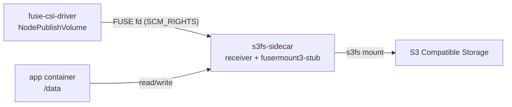

# s3fs マウント利用ガイド

このディレクトリは、FUSE CSI ドライバーを使って s3fs を利用するためのマニフェストを提供します。

## この実装でできること

- テナント Pod を非特権のまま S3 互換ストレージをマウント
- `volumeAttributes` の直編集だけで接続先を切り替え
- CSI 側に特権処理を集約し、ユーザー側は最小権限を維持

## アーキテクチャ（s3fs）



### 処理フロー

1. CSI が `NodePublishVolume` で FUSE fd を確保  
2. `s3fs-sidecar` が fd を受信し `s3fs` を起動  
3. app コンテナは `/data` を通常 I/O で利用

## 前提

- クラスタ管理者が CSI ドライバーをデプロイ済み
  - `csi/fuse-csi-driver.yaml`
  - `csi/fuse-csi-driver-daemonset-prod.yaml`
- Capsule/Kyverno ポリシーが適用済み（securityContext 自動注入）

## 含まれるファイル

- `deploy.yaml`: 本番向け Pod サンプル
- `deploy-kind.yaml`: kind 検証向け Pod サンプル

> 運用方針: `deploy.yaml` の `volumeAttributes` を直接編集して使用します。  

## 1. Secret の作成

```bash
kubectl create secret generic s3-credentials \
  --from-literal=access_key=YOUR_ACCESS_KEY \
  --from-literal=secret_key=YOUR_SECRET_KEY \
  -n <your-namespace>
```

## 2. マニフェストの調整

`deploy.yaml` の `volumeAttributes` を環境に合わせます。

| キー | 必須 | 説明 | 例 |
|---|---|---|---|
| `bucket` | 必須 | マウント対象バケット | `test-bucket` |
| `endpoint` | 必須 | S3 API エンドポイント | `http://minio.default.svc.cluster.local:9000` |
| `region` | 任意 | リージョン | `us-east-1` |
| `noCheckCert` | 任意 | 自己署名証明書時は `true` | `false` |

## 3. デプロイ

```bash
kubectl apply -f s3fs/deploy.yaml -n <your-namespace>
```

プライベートレジストリ利用時は、Pod spec に `imagePullSecrets` を追加します。

```yaml
spec:
  imagePullSecrets:
    - name: ghcr-secret
```

## 4. 動作確認

```bash
kubectl get pod -n <your-namespace>
kubectl logs <pod-name> -c s3fs-sidecar -n <your-namespace>
kubectl exec <pod-name> -c app -n <your-namespace> -- mount | grep fuse
kubectl exec <pod-name> -c app -n <your-namespace> -- ls -la /data
```

書き込み確認例:

```bash
kubectl exec <pod-name> -c app -n <your-namespace> -- sh -c 'echo hello > /data/healthcheck.txt && cat /data/healthcheck.txt'
```

## トラブルシュート

### 認証エラー

Secret のキー名と値を確認します（`access_key`, `secret_key`）。

```bash
kubectl get secret s3-credentials -n <your-namespace> -o yaml
```

### マウント失敗

```bash
kubectl describe pod <pod-name> -n <your-namespace>
kubectl logs <pod-name> -c s3fs-sidecar -n <your-namespace>
kubectl logs -n fuse-csi-system -l app=fuse-csi-driver
```

確認ポイント:

- `nodePublishSecretRef.name` が `s3-credentials` と一致しているか
- `bucket` / `endpoint` / `region` の typo がないか
- S3 側でアクセスキーに対象バケット権限があるか

## 関連

- ルート概要: [`../README.md`](../README.md)
