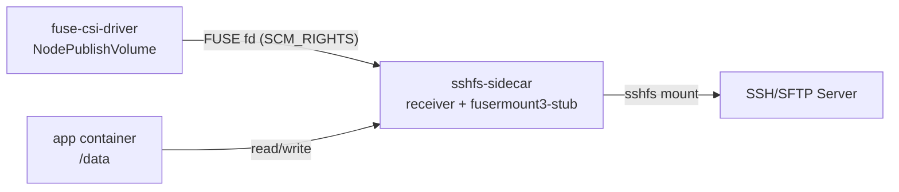

# sshfs マウント利用ガイド

このディレクトリは、FUSE CSI ドライバーを使って sshfs を利用するためのマニフェストを提供します。

## この実装でできること

- テナント Pod を非特権のまま SSH/SFTP ストレージをマウント
- `volumeAttributes` の直編集だけで接続先を切り替え
- CSI 側に特権処理を集約し、ユーザー側は最小権限を維持

## アーキテクチャ（sshfs）



### 処理フロー

1. CSI が `NodePublishVolume` で FUSE fd を確保  
2. `sshfs-sidecar` が fd を受信し `sshfs` を起動  
3. app コンテナは `/data` を通常 I/O で利用

## 前提

- クラスタ管理者が CSI ドライバーをデプロイ済み
  - `csi/fuse-csi-driver.yaml`
  - `csi/fuse-csi-driver-daemonset-prod.yaml`
- Capsule/Kyverno ポリシーが適用済み（securityContext 自動注入）

## 含まれるファイル

- `deploy.yaml`: 本番向け Pod サンプル
- `deploy-kind.yaml`: kind 検証向け Pod サンプル

> 運用方針: `deploy.yaml` の `volumeAttributes` を直接編集して使用します。  

## 1. Secret の作成

SSH 秘密鍵は **`--from-file`** で作成してください。  
`--from-literal` は改行欠落で `error in libcrypto` の原因になります。

```bash
kubectl create secret generic ssh-key \
  --from-file=private_key=~/.ssh/id_ed25519 \
  -n <your-namespace>
```

## 2. マニフェストの調整

`deploy.yaml` の `volumeAttributes` を環境に合わせます。

| キー | 必須 | 説明 | 例 |
|---|---|---|---|
| `host` | 必須 | SSH サーバーのホスト名/IP | `ssh-server.default.svc.cluster.local` |
| `user` | 必須 | SSH ユーザー名 | `testuser` |
| `remotePath` | 必須 | リモート側パス | `/data` |
| `port` | 任意 | SSH ポート | `22` |
| `strictHostKeyCheck` | 任意 | 本番は `accept-new` 推奨 | `accept-new` |

## 3. デプロイ

```bash
kubectl apply -f sshfs/deploy.yaml -n <your-namespace>
```

プライベートレジストリ利用時は、Pod spec に `imagePullSecrets` を追加します。

```yaml
spec:
  imagePullSecrets:
    - name: ghcr-secret
```

## 4. 動作確認

```bash
kubectl get pod -n <your-namespace>
kubectl logs <pod-name> -c sshfs-sidecar -n <your-namespace>
kubectl exec <pod-name> -c app -n <your-namespace> -- mount | grep fuse
kubectl exec <pod-name> -c app -n <your-namespace> -- ls -la /data
```

書き込み確認例:

```bash
kubectl exec <pod-name> -c app -n <your-namespace> -- sh -c 'echo hello > /data/healthcheck.txt && cat /data/healthcheck.txt'
```

## トラブルシュート

### `error in libcrypto`

Secret を再作成します。

```bash
kubectl delete secret ssh-key -n <your-namespace>
kubectl create secret generic ssh-key \
  --from-file=private_key=~/.ssh/id_ed25519 \
  -n <your-namespace>
```

### マウント失敗

```bash
kubectl describe pod <pod-name> -n <your-namespace>
kubectl logs <pod-name> -c sshfs-sidecar -n <your-namespace>
kubectl logs -n fuse-csi-system -l app=fuse-csi-driver
```

確認ポイント:

- `nodePublishSecretRef.name` が `ssh-key` と一致しているか
- `host` / `user` / `remotePath` の typo がないか
- SSH サーバー側で公開鍵が許可されているか

## 関連

- ルート概要: [`../README.md`](../README.md)
